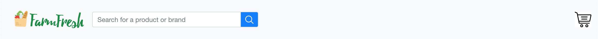
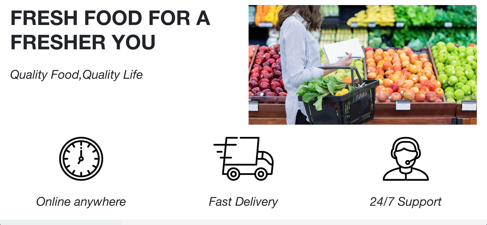
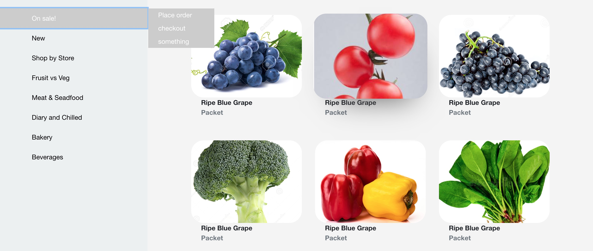
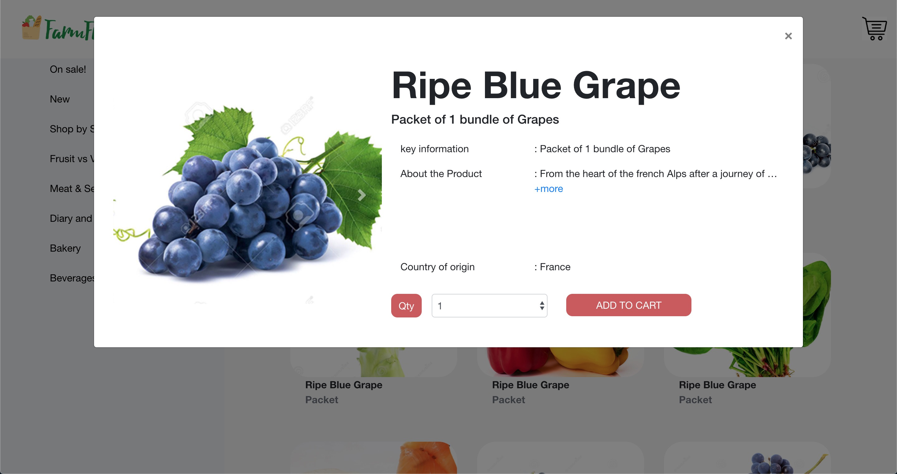

Demo - [React-farm-fresh-test](https://crayonnova.github.io/react-farm-fresh-test/)
---

# Description
This is the testing project with react.

# Tools in this test
- React
- React-Bootstrap
- Sass

# Technical point of view
 
In this test, i try to write styling as same as the given screens by interviewer. May be i can update with some additional styling for futher request. I am currently learning React and used in this test for showing technical proficiency. Using react, I can easily customize each componets without looking a bench of html code and styling is much more easier with SASS with BEM methdology.

# Components Structure
There are __4__ main components in this project - 


------
## Header Component
I only used bootstrap `Navbar` from react-bootstrap



For the banner cover up effect i used custom jquery code for transaction - 

CSS - 
```css
.Banner{
    height: 100vh;
    background-attachment: fixed;
    background:url('./../../assets/banner.jpg') no-repeat;
    background-size: 2000px;
    background-position: center 0px;
}
```

Scroll function - 
```javascript
function scrollBanner(banner) {
	let scrollPos = $(window).scrollTop();
	banner.css({
		'background-size' : 2000 - (scrollPos/3)+'px',
		'background-position' : 'center ' + (0 + scrollPos/2)+'px'
	});
}
```

Usage - 

```javascript
$(document).ready(function(){
	
	$(window).scroll(function() {
	
		scrollBanner($('.Banner'));

	});

});
```

------

## Promotion Component
- Font family and size applied
Used bootstrap `Card`



## Store Component

In `Store`, I used bootstrap button group for submenu style.
for the product view, i created a `items` arrray with required data. loop it through using `Array.map` in react `render()` .

 - hover shadow included
 - sidebar menu toggle included


```css
    .Card{
    &__img{
        
        border-radius: 30px;
        height: 200px;
        max-width: 100%;
        object-fit: cover;
        transition: 0.5s all ease-out;
        &:hover{
            -webkit-box-shadow: 10px 43px 69px -45px rgba(84,84,84,1);
            -moz-box-shadow: 10px 43px 69px -45px rgba(84,84,84,1);
            box-shadow: 10px 43px 69px -45px rgba(84,84,84,1);
            transform: scale(1.03);
        }
    }
    
}
```



## Modal Component
    Bootstrap modal is used for the project pop up display.

- Typography applied
- button customized
- text read more features added




	
